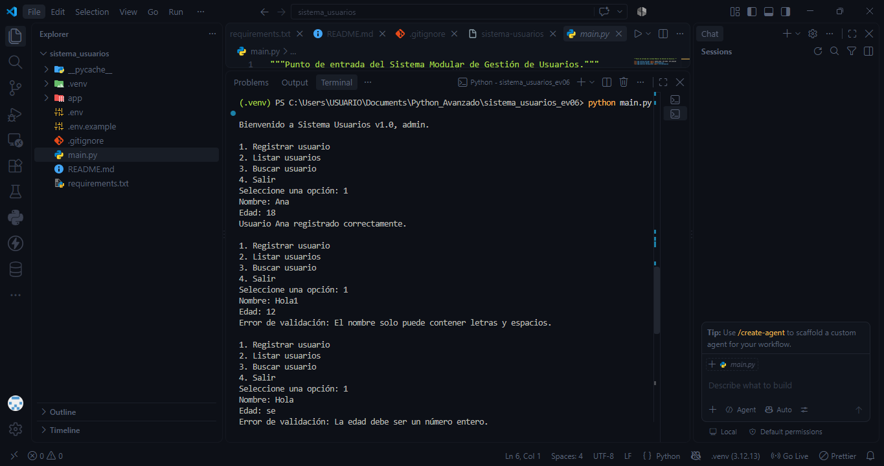
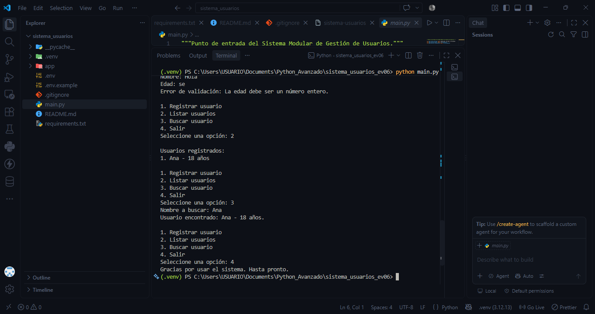

# Sistema Modular de Configuración y Gestión de Usuarios

Proyecto integrador para la evidencia **GA1-220501093-04-AA1-EV06** de Python avanzado (SENA). La aplicación de consola registra, lista y busca usuarios; usa un entorno virtual, dependencias, variables de entorno y paquetes de Python.

## Requisitos

- Python 3.10 o superior.
- Terminal de Windows, macOS o Linux.

## Instalación y ejecución

Desde la carpeta `sistema_usuarios`, cree y active el entorno virtual:

```powershell
py -m venv .venv
.\.venv\Scripts\Activate.ps1
```

En macOS/Linux use `python3 -m venv .venv` y `source .venv/bin/activate`.

Instale las dependencias y ejecute el sistema:

```powershell
python -m pip install -r requirements.txt
python main.py
```

Para salir del entorno virtual use `deactivate`.

## Uso

Al iniciar se muestra el nombre, versión y administrador configurados. El menú permite:

1. Registrar un usuario con nombre y edad.
2. Listar los usuarios registrados durante la ejecución.
3. Buscar un usuario por nombre.
4. Salir.

El programa valida nombres vacíos, caracteres no válidos, edades no numéricas o fuera de 0 a 120 y nombres repetidos. Los errores se controlan con la excepción `ErrorValidacion`, sin cerrar la aplicación.

## Estructura y modularización

```text
sistema_usuarios/
├── app/
│   ├── config/
│   │   └── settings.py       # Carga las variables del archivo .env
│   └── usuarios/
│       ├── gestor.py         # Registro, listado y búsqueda
│       └── validaciones.py   # Validación de nombre y edad
├── .env                      # Configuración local (no se publica)
├── .env.example              # Plantilla segura de configuración
├── main.py                   # Menú y punto de entrada
└── requirements.txt          # Dependencias exactas
```

Los archivos `__init__.py` convierten `app`, `config` y `usuarios` en paquetes. Así cada módulo tiene una responsabilidad concreta y puede importarse claramente desde `main.py`.

## Variables de entorno

El módulo `app/config/settings.py` usa `python-dotenv` para cargar `.env` y leer:

| Variable      | Propósito                             | Valor de ejemplo   |
| ------------- | ------------------------------------- | ------------------ |
| `APP_NAME`    | Nombre mostrado por la aplicación     | `Sistema Usuarios` |
| `APP_VERSION` | Versión mostrada al iniciar           | `1.0`              |
| `ADMIN_USER`  | Saludo personalizado al administrador | `admin`            |

`.env` está en `.gitignore`; para compartir la configuración sin datos reales se versiona solamente `.env.example`.

## Evidencias para el README / repositorio

Antes de entregar, agregue capturas reales en una carpeta `capturas/` y enlácela aquí:

- Creación del entorno virtual: comando `py -m venv .venv` y la carpeta creada.
- Instalación: `python -m pip install -r requirements.txt`.
- Ejecución: menú con un registro, listado y búsqueda exitosos.
- Variables de entorno: contenido no sensible de `.env` y el saludo inicial personalizado.



.

## Video de reflexión

https://www.youtube.com/watch?v=q1Xt-DQ1X4I&authuser=0.
